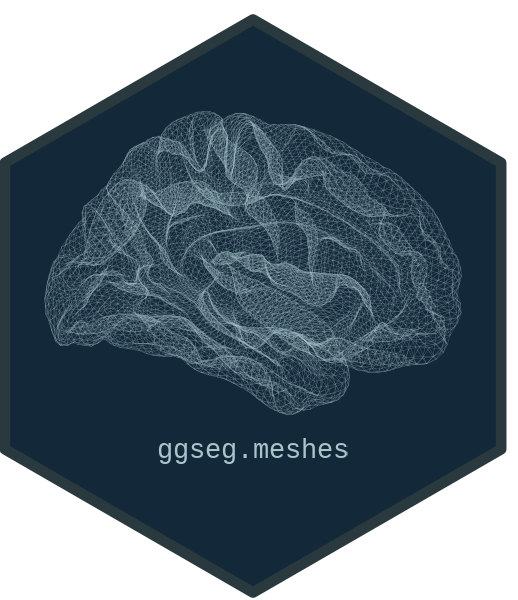

```{r}
#| label: setup
#| include: false
knitr::opts_chunk$set(
  collapse = TRUE,
  comment = "#>",
  fig.path = "man/figures/README-",
  echo = TRUE,
  message = FALSE
)

library(ggseg.meshes)
```

# ggseg.meshes 

<!-- badges: start -->
[](https://github.com/ggsegverse/ggseg.meshes/actions/workflows/test-coverage.yaml)
[](https://lifecycle.r-lib.org/articles/stages.html)
[](https://github.com/ggsegverse/ggseg.meshes/actions/workflows/code-quality.yaml)
[](https://github.com/ggsegverse/ggseg.meshes/actions/workflows/R-CMD-check.yaml)
<!-- badges: end -->

Additional brain surface meshes for the [ggsegverse](https://ggsegverse.github.io/ggseg/) ecosystem.
Ships cortical and cerebellar surfaces beyond the inflated cortical and SUIT 3D pial meshes bundled with the core packages.

## Meshes

### Cortical (fsaverage5)

All cortical meshes are at fsaverage5 resolution (10,242 vertices, 20,480 faces per hemisphere).

| Surface | Description |
|---------|-------------|
| `pial` | Grey matter / CSF boundary |
| `white` | Grey / white matter boundary |
| `midthickness` | Midpoint of pial and white surfaces |
| `semi-inflated` | 35/65 blend of white and inflated |
| `sphere` | Spherical registration surface |
| `smoothwm` | Smoothed white matter surface |
| `orig` | Original surface before topology correction |

### Cerebellar (SUIT)

| Surface | Description |
|---------|-------------|
| `suit_flat` | SUIT flatmap projection (28,935 vertices) |

## Installation

Install from the [ggsegverse r-universe](https://ggsegverse.r-universe.dev):

```{r}
#| label: install-runiverse
#| eval: false
options(
  repos = c(
    ggsegverse = "https://ggsegverse.r-universe.dev",
    CRAN = "https://cloud.r-project.org"
  )
)
install.packages("ggseg.meshes")
```

Or from GitHub:

```{r}
#| label: install-github
#| eval: false
# install.packages("remotes")
remotes::install_github("ggsegverse/ggseg.meshes")
```

## Usage

```{r}
#| label: cortical
library(ggseg.meshes)

mesh <- get_cortical_mesh("lh", "pial")
str(mesh)
```

```{r}
#| label: available
available_cortical_surfaces()
available_cerebellar_surfaces()
```

### With ggseg3d

ggseg.meshes integrates with [ggseg3d](https://ggsegverse.github.io/ggseg3d/) through `resolve_brain_mesh()`.
When installed, all surfaces become available for 3D rendering:

```{r}
#| label: ggseg3d-usage
#| eval: false
library(ggseg3d)

ggseg3d(atlas = dk(), surface = "pial") |>
  pan_camera("left lateral")
```

## Citation

Mowinckel & Vidal-Piñeiro (2020).
*Visualization of Brain Statistics With R Packages ggseg and ggseg3d.*
Advances in Methods and Practices in Psychological Science.
[doi:10.1177/2515245920928009](https://doi.org/10.1177/2515245920928009)

## Funding

This tool is partly funded by:

**EU Horizon 2020 Grant:** Healthy minds 0-100 years: Optimising the use of
European brain imaging cohorts (Lifebrain).

**Grant agreement number:** 732592.

**Call:** Societal challenges: Health, demographic change and well-being
