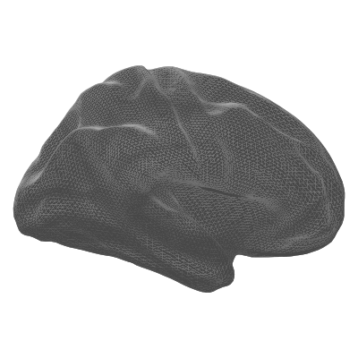
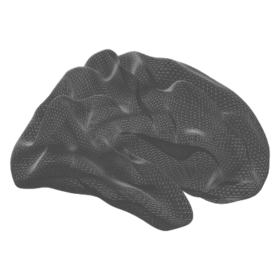
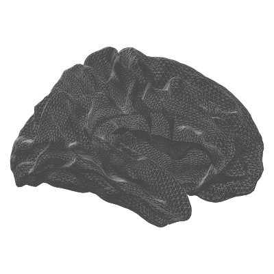
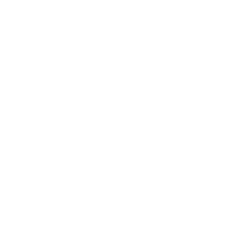

# Introduction to ggseg.meshes

The ggseg ecosystem uses brain surface meshes to render atlas
parcellations in 3D. The core packages ship with the inflated cortical
mesh (in ggseg.formats) and the SUIT 3D pial cerebellar mesh.
ggseg.meshes extends this with additional surfaces for both cortical and
cerebellar visualisation.

## Available surfaces

### Cortical

All cortical meshes are fsaverage5 resolution: 10,242 vertices and
20,480 triangular faces per hemisphere.

``` r
available_cortical_surfaces()
#> [1] "pial"          "white"         "semi-inflated" "sphere"       
#> [5] "smoothwm"      "orig"
```

| Surface           | Description                     | Use case                                              |
|-------------------|---------------------------------|-------------------------------------------------------|
| **pial**          | Grey matter / CSF boundary      | Anatomically accurate rendering                       |
| **white**         | Grey / white matter boundary    | White matter surface visualisation                    |
| **semi-inflated** | 35/65 blend of white + inflated | Compromise between anatomical accuracy and visibility |
| **sphere**        | Spherical registration surface  | Surface-based registration, QC                        |
| **smoothwm**      | Smoothed white matter           | Smoother alternative to white surface                 |
| **orig**          | Pre-topology-correction surface | Debugging surface reconstruction                      |

|                                    |                                        |                                                  |
|:----------------------------------:|:--------------------------------------:|:------------------------------------------------:|
|      |        |  |
|                pial                |                 white                  |                  semi-inflated                   |
|  |  |                    |
|               sphere               |                smoothwm                |                       orig                       |

### Cerebellar

``` r
available_cerebellar_surfaces()
#> [1] "suit_flat"
```

The SUIT flatmap is a 2D flattened projection of the cerebellar cortex
with 28,935 vertices. Vertex indices from cerebellar atlases map
directly to this surface since it shares the same vertex space as the
SUIT 3D pial mesh in ggseg.formats (minus the 1,078 peduncular cap
vertices).



SUIT cerebellar flatmap

## Accessing meshes

Each mesh is a list with `vertices` (data.frame: x, y, z) and `faces`
(data.frame: i, j, k).

``` r
mesh <- get_cortical_mesh("lh", "pial")
head(mesh$vertices)
#>              x         y         z
#> 1 -19.34336472 38.735958 67.220139
#> 2 -69.06122589 16.662487 61.281273
#> 3  -9.23326397  9.717618 46.580341
#> 4  43.11487198 24.019428 23.926214
#> 5   0.04929276 59.861500  8.974564
#> 6 -49.40507889 50.645546 47.813751
head(mesh$faces)
#>   i    j    k
#> 1 1 2565 2563
#> 2 1 2563 2566
#> 3 1 2566 2568
#> 4 1 2568 2570
#> 5 1 2570 2565
#> 6 4 2575 2573
```

``` r
flat <- get_cerebellar_flatmap()
nrow(flat$vertices)
#> [1] 28935
nrow(flat$faces)
#> [1] 56588
```

## Integration with ggseg3d

When ggseg.meshes is installed, `ggseg3d::resolve_brain_mesh()` can
resolve all surfaces provided by this package. This means you can render
atlases on any surface:

``` r
library(ggseg3d)

ggseg3d(atlas = dk(), surface = "pial") |>
  pan_camera("left lateral")

ggseg3d(atlas = dk(), surface = "white") |>
  pan_camera("left lateral")
```

## Mesh structure

All cortical meshes share the same face topology (triangle connectivity)
as the inflated mesh in ggseg.formats. This means vertex indices from
cortical atlases work with any surface – the same vertex index refers to
the same anatomical location across pial, white, inflated, sphere, etc.

``` r
vapply(available_cortical_surfaces(), function(s) {
  mesh <- get_cortical_mesh("lh", s)
  c(vertices = nrow(mesh$vertices), faces = nrow(mesh$faces))
}, integer(2))
#>           pial white semi-inflated sphere smoothwm  orig
#> vertices 10242 10242         10242  10242    10242 10242
#> faces    20480 20480         20480  20480    20480 20480
```

The cerebellar flatmap shares vertex indices with the SUIT 3D pial mesh
(indices 0–28,934), so cerebellar atlas vertex assignments apply to both
the 3D and flatmap representations.
