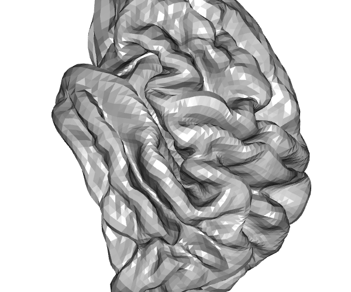
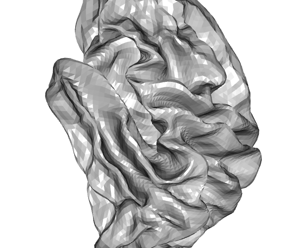
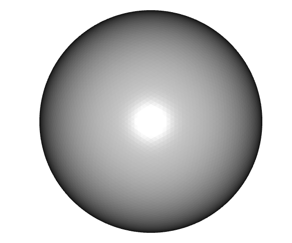

```{r}
#| label: setup
#| include: false
knitr::opts_chunk$set(
  collapse = TRUE,
  comment = "#>"
)
library(ggseg.meshes)
```

The ggseg ecosystem uses brain surface meshes to render atlas parcellations in 3D.
The core packages ship with the inflated cortical mesh (in ggseg.formats) and the SUIT 3D pial cerebellar mesh.
ggseg.meshes extends this with additional surfaces for both cortical and cerebellar visualisation.

## Available surfaces

### Cortical

All cortical meshes are fsaverage5 resolution: 10,242 vertices and 20,480 triangular faces per hemisphere.

```{r}
#| label: available-cortical
available_cortical_surfaces()
```

| Surface | Description | Use case |
|---------|-------------|----------|
| **pial** | Grey matter / CSF boundary | Anatomically accurate rendering |
| **white** | Grey / white matter boundary | White matter surface visualisation |
| **semi-inflated** | 50/50 blend of white + inflated | Compromise between anatomical accuracy and visibility |
| **sphere** | Spherical registration surface | Surface-based registration, QC |
| **smoothwm** | Smoothed white matter | Smoother alternative to white surface |
| **orig** | Pre-topology-correction surface | Debugging surface reconstruction |

| | | |
|:---:|:---:|:---:|
| {width=200} | {width=200} | {width=200} |
| pial | white | semi-inflated |
| {width=200} | {width=200} | {width=200} |
| sphere | smoothwm | orig |

### Cerebellar

```{r}
#| label: available-cerebellar
available_cerebellar_surfaces()
```

The SUIT flatmap is a 2D flattened projection of the cerebellar cortex with 28,935 vertices.
Vertex indices from cerebellar atlases map directly to this surface since it shares the same vertex space as the SUIT 3D pial mesh in ggseg.formats (minus the 1,078 peduncular cap vertices).

{width=300}

## Accessing meshes

Each mesh is a list with `vertices` (data.frame: x, y, z) and `faces` (data.frame: i, j, k).

```{r}
#| label: access-cortical
mesh <- get_cortical_mesh("lh", "pial")
head(mesh$vertices)
head(mesh$faces)
```

```{r}
#| label: access-cerebellar
flat <- get_cerebellar_flatmap()
nrow(flat$vertices)
nrow(flat$faces)
```

## Integration with ggseg3d

When ggseg.meshes is installed, `ggseg3d::resolve_brain_mesh()` can resolve all surfaces provided by this package.
This means you can render atlases on any surface:

```{r}
#| label: ggseg3d-example
#| eval: false
library(ggseg3d)

ggseg3d(atlas = dk(), surface = "pial") |>
  pan_camera("left lateral")

ggseg3d(atlas = dk(), surface = "white") |>
  pan_camera("left lateral")
```

## Mesh structure

All cortical meshes share the same face topology (triangle connectivity) as the inflated mesh in ggseg.formats.
This means vertex indices from cortical atlases work with any surface -- the same vertex index refers to the same anatomical location across pial, white, inflated, sphere, etc.

```{r}
#| label: vertex-count
vapply(available_cortical_surfaces(), function(s) {
  mesh <- get_cortical_mesh("lh", s)
  c(vertices = nrow(mesh$vertices), faces = nrow(mesh$faces))
}, integer(2))
```

The cerebellar flatmap shares vertex indices with the SUIT 3D pial mesh (indices 0--28,934), so cerebellar atlas vertex assignments apply to both the 3D and flatmap representations.
