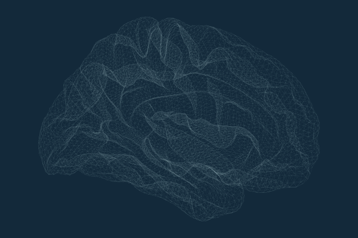
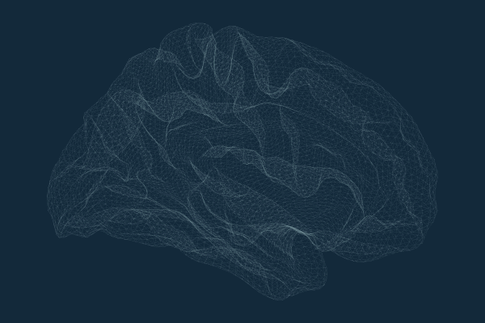
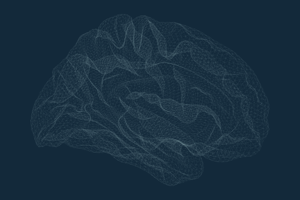
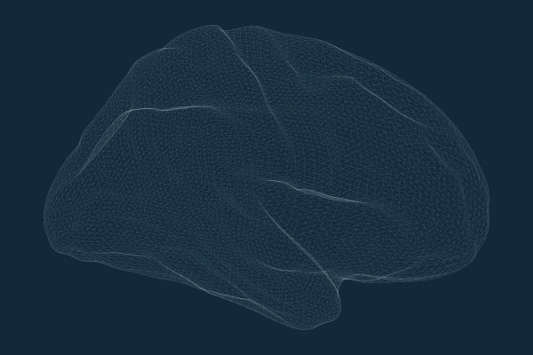
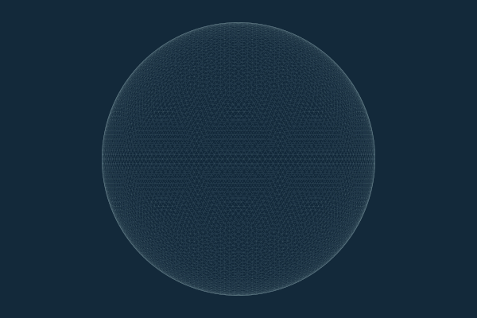
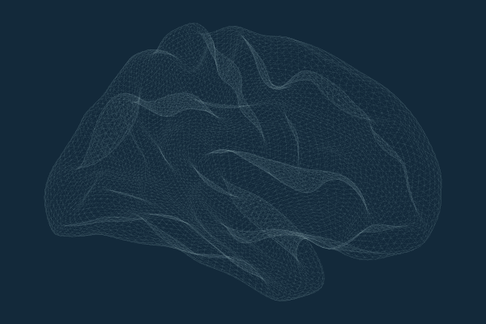
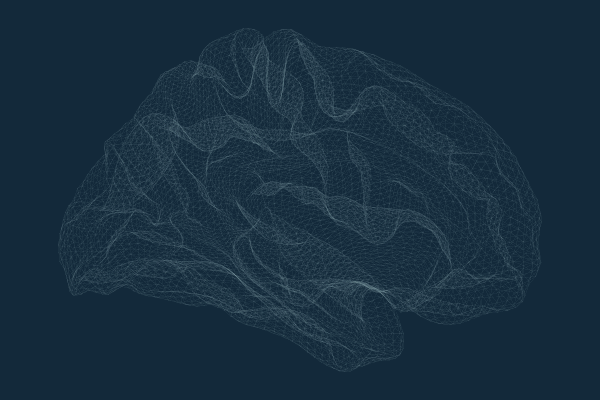
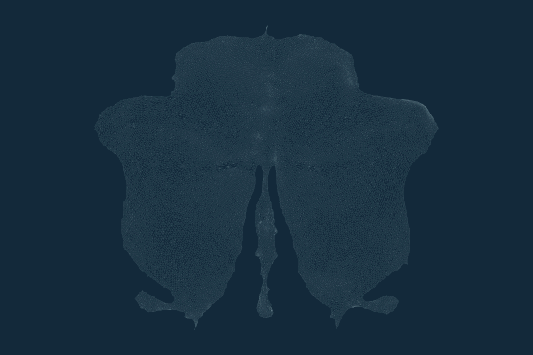

```{r}
#| label: setup
#| include: false
knitr::opts_chunk$set(
  collapse = TRUE,
  comment = "#>"
)
library(ggseg.meshes)
```

The ggseg ecosystem uses brain surface meshes to render atlas parcellations in 3D.
The core packages ship with the inflated cortical mesh (in ggseg.formats) and the SUIT 3D pial cerebellar mesh.
ggseg.meshes extends this with additional surfaces for both cortical and cerebellar visualisation.

## Available surfaces

### Cortical

All cortical meshes are fsaverage5 resolution: 10,242 vertices and 20,480 triangular faces per hemisphere.

```{r}
#| label: available-cortical
available_cortical_surfaces()
```

| Surface | Description | Use case |
|---------|-------------|----------|
| **pial** | Grey matter / CSF boundary | Anatomically accurate rendering |
| **white** | Grey / white matter boundary | White matter surface visualisation |
| **midthickness** | Midpoint of pial + white | HCP-style analyses, functional data sampling |
| **semi-inflated** | 35/65 blend of white + inflated | Compromise between anatomical accuracy and visibility |
| **sphere** | Spherical registration surface | Surface-based registration, QC |
| **smoothwm** | Smoothed white matter | Smoother alternative to white surface |
| **orig** | Pre-topology-correction surface | Debugging surface reconstruction |

| | | |
|:---:|:---:|:---:|
| {width=200} | {width=200} | {width=200} |
| pial | white | midthickness |
| {width=200} | {width=200} | {width=200} |
| semi-inflated | sphere | smoothwm |
| {width=200} | | |
| orig | | |

### Cerebellar

```{r}
#| label: available-cerebellar
available_cerebellar_surfaces()
```

The SUIT flatmap is a 2D flattened projection of the cerebellar cortex with 28,935 vertices.
Its relationship to the SUIT 3D pial mesh in ggseg.formats -- which vertex indices carry over, and which cannot be drawn -- is documented in full at `?get_cerebellar_flatmap`, which is the authority for that correspondence.

{width=300}

## Accessing meshes

Each mesh is a list with `vertices` (data.frame: x, y, z) and `faces` (data.frame: i, j, k).
The cortical coordinates are rotated 90 degrees from FreeSurfer's native axes, so `x` is anterior-posterior and `y` is left-right; see `?get_cortical_mesh` for the full convention.

```{r}
#| label: access-cortical
mesh <- get_cortical_mesh("lh", "pial")
head(mesh$vertices)
head(mesh$faces)
```

```{r}
#| label: access-cerebellar
flat <- get_cerebellar_flatmap()
nrow(flat$vertices)
nrow(flat$faces)
```

## Integration with ggseg3d

When ggseg.meshes is installed, `ggseg3d::resolve_brain_mesh()` can resolve all surfaces provided by this package.
This means you can render atlases on any surface:

```{r}
#| label: ggseg3d-example
#| eval: false
library(ggseg3d)

ggseg3d(atlas = dk(), surface = "pial") |>
  pan_camera("left lateral")

ggseg3d(atlas = dk(), surface = "white") |>
  pan_camera("left lateral")
```

## Mesh structure

All cortical meshes here share one face table, byte-for-byte, so vertex indices from cortical atlases work with any of them -- the same vertex index refers to the same anatomical location across pial, white, semi-inflated, sphere, and the rest.

That face table describes the same triangle connectivity as the inflated mesh in ggseg.formats, but the two are **not** interchangeable as written: the ggseg.formats faces are 0-based and these are 1-based.
`ggseg.formats::get_brain_mesh("lh")$faces + 1` is exactly the face table returned here.
Read the `face_index_base` attribute rather than assuming a base, on either side.

```{r}
#| label: vertex-count
vapply(
  available_cortical_surfaces(),
  function(s) {
    mesh <- get_cortical_mesh("lh", s)
    c(vertices = nrow(mesh$vertices), faces = nrow(mesh$faces))
  },
  integer(2)
)
```
